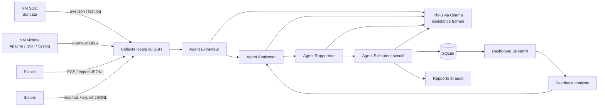

# Rapport final — Système multi-agents pour l’automatisation des tâches d’un analyste SOC

## 1. Résumé du projet

Ce projet réalise un prototype local d’assistant SOC capable de collecter des
journaux de sécurité, de les normaliser, de corréler les événements, de détecter
des incidents, de produire une explication en français et de générer des
rapports ainsi que des actions de réponse simulées.

L’orchestration repose sur **LangGraph**, la validation des données sur
**Pydantic**, l’enrichissement linguistique sur le petit modèle local
**Phi-3 avec Ollama** pour assister les quatre agents, la persistance sur **SQLite** et la visualisation sur
**Streamlit**. Les règles déterministes restent responsables du type
d’incident, de sa sévérité et de son niveau de confiance. Le SLM n’a donc pas
l’autorité de déclencher une alerte ou une action réelle.

## 2. Objectifs

Les objectifs principaux sont :

- centraliser les journaux de plusieurs sources SOC ;
- transformer des formats hétérogènes en un schéma commun ;
- détecter et corréler automatiquement des comportements suspects ;
- fournir une explication lisible à l’analyste ;
- générer un rapport par incident ;
- conserver une piste d’audit dans SQLite et dans des fichiers locaux ;
- intégrer le retour de l’analyste sans autoriser un apprentissage autonome
  non contrôlé ;
- garantir qu’aucune action de confinement réelle ne soit exécutée dans le
  cadre du prototype.

## 3. Travail réalisé

Le travail couvre les éléments suivants :

1. Mise en place d’un laboratoire composé d’un hôte Windows, d’une VM SOC et
   d’une VM victime.
2. Installation et configuration de Suricata sur la VM SOC.
3. Installation d’Apache, SSH et Rsyslog sur la VM victime.
4. Collecte des journaux en mode local ou par SSH/SFTP avec Paramiko.
5. Développement de connecteurs pour Suricata, Apache, les authentifications
   Linux, Syslog, Elastic et Splunk.
6. Normalisation de tous les événements dans un modèle Pydantic commun.
7. Construction du workflow multi-agents avec LangGraph.
8. Détection déterministe, corrélation temporelle et association à
   MITRE ATT&CK.
9. Assistance des quatre agents avec Phi-3 et mécanisme de repli local.
10. Génération de rapports Markdown et d’actions de réponse simulées.
11. Persistance dans SQLite et création d’un dashboard Streamlit.
12. Mise en place d’une boucle de feedback analyste à seuils bornés.
13. Développement de tests automatisés et d’un benchmark reproductible.
14. Adaptation du projet au nouveau plan d’adressage du laboratoire.

# 4. Documentation technique

## 4.1 Architecture physique

| Machine | Interface | Adresse | Fonction |
|---|---|---:|---|
| Hôte Windows | Adaptateur de laboratoire | `192.168.231.1` | Application multi-agents, Ollama, SQLite et Streamlit |
| VM SOC Ubuntu | `ens33` NAT | `192.168.10.132` | Accès réseau de la VM SOC |
| VM SOC Ubuntu | `ens37` host-only | `192.168.231.128` | Capture Suricata et collecte SSH |
| VM victime Ubuntu | `ens33` NAT | `192.168.10.133` | Accès réseau de la VM victime |
| VM victime Ubuntu | `ens37` host-only | `192.168.231.129` | Apache, SSH, Syslog et journaux surveillés |

L’interface `ens37` constitue le réseau privé du laboratoire. Elle permet au PC
Windows de joindre les deux VM sans exposer les services du laboratoire sur
Internet. L’interface `ens33` fournit l’accès NAT nécessaire aux mises à jour et
aux téléchargements de paquets.

## 4.2 Architecture logique



Le graphe LangGraph suit une séquence contrôlée :

```text
START → Extracteur → Analyseur → Rapporteur → Exécuteur → Persistance → END
```

L’état partagé `SOCState` transporte les événements bruts, les événements
normalisés, les incidents, les rapports, les actions, les erreurs et les
métadonnées d’exécution.

## 4.3 Sources de données

| Source | Fichier ou interface | Données principales |
|---|---|---|
| Suricata | `eve.json` | Alertes, flux, protocoles, IP, ports et signatures |
| Suricata | `fast.log` | Résumé textuel des alertes réseau |
| Apache | `access.log` | Requêtes HTTP, codes de réponse, chemins et clients |
| Apache | `error.log` | Erreurs serveur et accès à des ressources absentes |
| Linux SSH | `auth.log` | Échecs et réussites d’authentification |
| Linux | `syslog` | Événements système et réseau |
| Elastic | API ou `elastic_alerts.jsonl` | Alertes au format ECS |
| Splunk | API ou `splunk_alerts.jsonl` | Résultats des recherches de corrélation |

Deux modes sont disponibles :

- **Mode local** : lecture des copies placées dans `shared_logs/` ;
- **Mode SSH** : récupération SFTP depuis les VM, puis traitement local. En cas
  d’échec, le système se replie sur les journaux déjà disponibles.

## 4.4 Modèle de données

Chaque événement est converti en `NormalizedEvent`. Le schéma comprend
notamment : horodatage, type de source, type d’événement, IP et ports source et
destination, protocole, hôte, utilisateur, signature, sévérité, message et
événement brut.

Un `Incident` contient : identifiant unique, type, titre, sévérité, confiance,
IP concernées, hôte affecté, tactique et technique MITRE ATT&CK, preuves,
explication, recommandation, rapport et statut.

SQLite conserve cinq familles d’informations :

- `raw_events` : événements normalisés et représentation brute ;
- `incidents` : incidents corrélés ;
- `actions` : actions simulées ;
- `runs` : métriques et statut de chaque exécution ;
- `analyst_feedback` : verdicts et commentaires de l’analyste.

# 5. Description des agents

## 5.1 Agent Extracteur

L’Agent Extracteur constitue le point d’entrée du pipeline.

**Entrées :** journaux Suricata, Apache, Linux, Elastic et Splunk.

**Traitements :**

- déclenche la copie SSH lorsque ce mode est demandé ;
- charge les journaux disponibles ;
- utilise le parseur adapté à chaque source ;
- ignore les lignes non exploitables sans arrêter tout le pipeline ;
- convertit les événements valides en objets Pydantic normalisés ;
- transmet les avertissements dans l’état partagé.

**Sorties :** événements bruts, événements normalisés et erreurs non bloquantes.

Sur un nombre borné de lignes non reconnues, Phi-3 peut ajouter une note de
lecture non décisionnelle. Les champs structurés restent fixés par Python.

## 5.2 Agent Analyseur

L’Agent Analyseur assure la détection et la corrélation.

Il regroupe les événements par adresse source et par fenêtre temporelle. Le
seuil initial de brute force SSH est de cinq échecs. Les accès à des chemins web
sensibles sont regroupés comme reconnaissance web. Les événements Suricata,
SIEM et système peuvent également produire des incidents réseau ou corrélés.

Pour chaque incident, les règles fixent :

- le type et le titre ;
- la sévérité ;
- le score de confiance ;
- les preuves associées ;
- la tactique et la technique MITRE ATT&CK.

Phi-3 reçoit ensuite uniquement les informations déjà validées afin de rédiger
une explication et une recommandation. Si Ollama est absent, lent ou en erreur,
une réponse déterministe est utilisée. Cette séparation limite l’impact des
hallucinations du modèle.

## 5.3 Agent Rapporteur

L’Agent Rapporteur transforme chaque incident en document Markdown. Le rapport
contient l’identification, la chronologie, les preuves, le périmètre, l’analyse,
le mapping MITRE, les recommandations, les limites et un rappel indiquant que
les réponses sont simulées. Phi-3 ajoute une synthèse professionnelle sans
modifier les rubriques du template Python. Une version courte est également
préparée pour le dashboard.

## 5.4 Agent Exécuteur

L’Agent Exécuteur ne possède aucune fonction de blocage réel. Il génère des
artefacts auditables :

- ajout simulé à une blocklist ;
- notification locale ;
- création simulée d’un ticket ;
- plan d’isolation avec validation humaine obligatoire ;
- playbook de remédiation ;
- statut `contained_simulated`.

Phi-3 peut proposer une action simulée parmi une liste blanche. Python valide
la proposition et conserve dans tous les cas la politique déterministe
existante. Il ne modifie ni pare-feu, ni service, ni compte, ni machine distante.

## 5.5 Agent de persistance

La dernière étape du graphe enregistre de manière cohérente les événements,
incidents, actions et métriques d’exécution dans SQLite. Une exécution contenant
des avertissements reçoit le statut `completed_with_warnings` ; sinon elle est
marquée `completed`.

## 5.6 Boucle adaptative supervisée

Depuis Streamlit, l’analyste classe un incident comme vrai positif, faux
positif ou à revoir. Après au moins trois retours, les seuils concernés peuvent
être ajustés. Ils restent toujours bornés entre 3 et 10. Le feedback ne peut
jamais activer une action système réelle.

# 6. Rapport d’expérimentation

## 6.1 Protocole

L’expérience utilise les journaux versionnés dans `shared_logs/` et une vérité
terrain dans `experiments/ground_truth.json`. Les incidents sont comparés sous
la forme `(type d’incident, IP source)`, en tenant compte du nombre attendu de
chaque incident.

Deux variantes ont été exécutées trois fois :

1. **Déterministe** : parsing, normalisation, corrélation et explication locale
   de repli ;
2. **Ollama Phi-3** : benchmark historique de la corrélation et de
   l'enrichissement de l'Analyseur par Phi-3.

Les mesures portent sur la précision, le rappel, le F1, la durée moyenne,
l’écart-type et le pic de mémoire Python observé avec `tracemalloc`.

## 6.2 Efficacité de détection

| Mesure | Résultat |
|---|---:|
| Incidents attendus | 8 |
| Vrais positifs | 8 |
| Faux positifs | 0 |
| Faux négatifs | 0 |
| Précision | 100 % |
| Rappel | 100 % |
| Score F1 | 100 % |

Ces résultats montrent que les règles reconnaissent correctement tous les cas
du jeu de laboratoire. Ils ne prouvent pas une précision de 100 % sur un réseau
réel : la vérité terrain est petite, contrôlée et construite autour des règles
évaluées.

## 6.3 Performances des SLMs

| Variante | Répétitions | Durée moyenne | Écart-type | Pic mémoire Python moyen |
|---|---:|---:|---:|---:|
| Déterministe | 3 | 0,0138 s | 0,0078 s | 0,074 MB |
| Ollama Phi-3 | 3 | 27,2040 s | 1,6087 s | 9,069 MB |

Phi-3 augmente fortement la latence, car une génération est effectuée pour les
incidents. Cette dépense n’améliore pas les métriques de détection : le modèle
sert à améliorer la lisibilité et le contexte des explications, pas à modifier
les décisions déterministes.

La mémoire mesurée correspond au processus Python instrumenté. Elle ne
représente pas toute la mémoire consommée par le serveur Ollama ni par le modèle
chargé en mémoire. Le temps peut aussi augmenter lors du premier chargement du
modèle ou sur une machine moins puissante.

## 6.4 Validation logicielle

La suite automatisée contient dix tests couvrant notamment les parseurs
Suricata, Apache, SSH, les formats SIEM et les mécanismes de réponse adaptative.
La dernière validation du projet a donné :

```text
10 passed
```

# 7. Limites

- Le jeu de données est réduit et principalement destiné à la démonstration.
- Les métriques parfaites sont spécifiques à cette vérité terrain contrôlée.
- La lecture complète des fichiers peut retraiter des événements déjà vus.
- `eve.json` et `fast.log` peuvent décrire la même alerte et nécessitent une
  déduplication plus avancée.
- Le regroupement par tranches temporelles peut séparer des événements proches
  situés de part et d’autre d’une limite de tranche.
- La qualité des résultats dépend des règles, de la qualité des logs et de la
  synchronisation des horloges des machines.
- Phi-3 peut produire une formulation incomplète ou imprécise malgré un prompt
  contraint.
- L’authentification SSH par mot de passe convient au laboratoire, mais une clé
  dédiée est préférable dans un environnement réel.
- Le dashboard ne fournit pas encore une gestion complète des rôles et des
  permissions.
- Les actions de réponse sont uniquement simulées.

# 8. Perspectives

Les améliorations recommandées sont :

1. Ajouter une lecture incrémentale avec mémorisation des offsets.
2. Dédupliquer les alertes provenant de plusieurs fichiers ou SIEM.
3. Tester le système avec des datasets publics plus larges et plusieurs types
   d’attaques.
4. Mesurer séparément la latence à froid et à chaud de Phi-3.
5. Comparer plusieurs petits modèles selon la qualité, la vitesse et la
   consommation mémoire.
6. Ajouter un inventaire des actifs et un enrichissement local des IOC.
7. Renforcer l’authentification du dashboard et chiffrer les secrets.
8. Remplacer le mot de passe SSH par des clés à privilèges minimaux.
9. Ajouter une file d’approbation humaine avant toute future intégration de
   réponse active.
10. Conteneuriser les composants et automatiser le déploiement et les tests.

# 9. Conclusion

Le projet démontre qu’un workflow multi-agents local peut automatiser une part
importante du travail répétitif d’un analyste SOC : collecte, normalisation,
corrélation, documentation et préparation de la réponse. L’architecture garde
les décisions critiques dans des règles explicites et auditables, tandis que
Phi-3 améliore la présentation des résultats. Le prototype est fonctionnel et
reproductible pour un laboratoire académique. Son passage vers un usage réel
demanderait surtout un dataset plus représentatif, une collecte incrémentale,
une meilleure déduplication, une sécurité d’accès renforcée et une validation
humaine formalisée.
